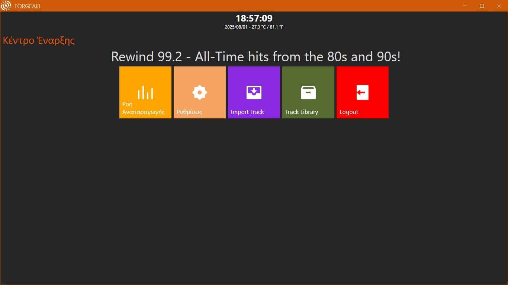
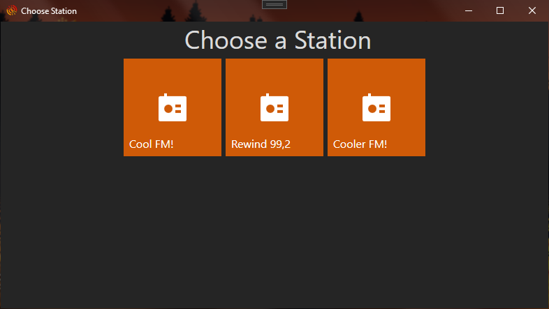

# ForgeAir - Work In Progress (DO NOT USE)

<p align="center">
  
</p>
<h2>🚧 Due to my Panhellenic exams, I am currently unable to develop and
 maintain ForgeAir. </h2>

**ForgeAir** is a w.i.p modern, modular and lightweight radio automation system built
with C# and WPF. Designed for my use case mainly but that does not limit you in
choosing ForgeAir.

---

## 📸 Screenshots

<p align="center">
  
</p>

<p align="center">
  
</p>

---

### Credits

Thanks to these people/groups for helping through ForgeAir's development:

- [@andreiv1](github.com/andreiv1)
 for helping in early development with his valuable knowledge and helping me
  write better code :))

...and to all of you who use ForgeAir (?)

---

## 🚀 Getting Started

### Requirements

- x64 CPU and host
- Windows 10 1809 (17763) or better
- .NET 8 SDK
- Visual Studio 2022
- Telegram Bot
- WeatherAPI Account
- MySQL/MariaDB server

### Building

- You need to create an account to [WeatherAPI](https://www.weatherapi.com/) in
order to make use of the temperature feature in ForgeAir
- You must provide your own BASS libraries from  
[Un4Seen Developments](https://www.un4seen.com/)
provided you already have a commercial license bought
- For crash reporting, ForgeAir uses a Telegram bot. You must create yourself a
 bot to make use of it

```bash
git clone https://github.com/akarapatakis/ForgeAir.git
cd ForgeAir
- Create a .env file and add your WeatherAPI and Telegram bot secrets
WEATHERAPI_KEY=XXXXXXXXXXXXXXXXXXXXXXXXXXXXX
CRASH_REPORTER_TELEGRAM_BOT_TOKEN=XXXXXXXXXXXXX
CRASH_REPORTER_TELEGRAM_CHATID=XXXXXXXXXX

Open ForgeAir.sln in Visual Studio and build or use MSBuild 

Copy configuration.ini from ForgeAir.Playout to the output directory 
and create a station by modifying the file with:

[Stations]
0=default_station

create the directory tree Stations\default_station
and create a default_station.ini and add the following template

Remember to modify/fill the values for your needs!

[General]
Tag=Default Station
AutoStart=0
PlayAutoAtStart=1

[Database]
Host=
Port=
DatabaseName=
Password=
User=
[MainOutput]
AudioEngine=NAudio
MainOutDevice==1
MainOutDeviceMethod=MME
MainOutSampleRate=44100
MainOutBitDepth=16
MainOutChannels=2
MainOutBuffer=333
MainOutUseDSound=1
FixClickingWorkAround=1
[VST]
Enabled=0
EffectPath=
```
